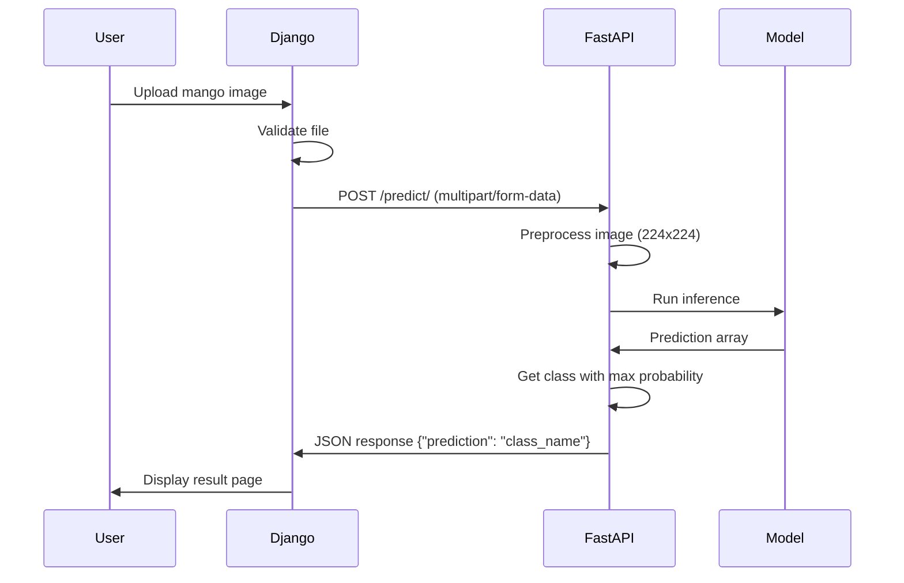

## Overview

The Mango Damage Detection system uses a **two-tier architecture** that separates concerns between user interface handling and machine learning inference. This design provides scalability, maintainability, and optimal performance for serving TensorFlow models in production.

<CardGroup cols={2}>
  <Card title="Django Frontend" icon="globe">
    Handles user interactions, file uploads, and displays prediction results on port 8000
  </Card>
  <Card title="FastAPI Backend" icon="brain">
    Serves the TensorFlow model and processes inference requests on port 8001
  </Card>
</CardGroup>

## Architecture Components

<Steps>
  <Step title="User Interface Layer (Django)">
    Django serves as the web frontend, providing:
    - File upload interface for mango images
    - Request handling and validation
    - Result presentation to users
    - Static file serving and templating
  </Step>

  <Step title="API Layer (FastAPI)">
    FastAPI handles ML inference operations:
    - Model loading and serving
    - Image preprocessing
    - Prediction generation
    - JSON response formatting
  </Step>

  <Step title="Model Layer (TensorFlow)">
    VGG19-based model performs classification:
    - Pre-trained on mango damage dataset
    - 5-class damage detection
    - Optimized inference pipeline
  </Step>
</Steps>

## Request Flow

Here's how a prediction request flows through the system:



### Step-by-Step Flow

<Accordion title="1. Image Upload (Django)">
The user uploads an image through the Django web interface. The view handles the file upload:

```python
from django.shortcuts import render
from django.conf import settings
import requests

def index(request):
    if request.method == 'POST':
        if 'file' in request.FILES:
            file = request.FILES['file']
            file_data = file.read()
            files = {'file': (file.name, file_data, file.content_type)}
            
            # Forward to FastAPI
            response = requests.post(
                f"{settings.FAST_API_DOCKER_HOST}/predict", 
                files=files
            )
            
            if response.status_code == 200:
                prediction = response.json().get("prediction")
                return render(request, 'results.html', {
                    'prediction': prediction, 
                    'filename': file.name
                })
```

<Note>
Django acts as a proxy, forwarding the image to FastAPI without storing it permanently.
</Note>
</Accordion>

<Accordion title="2. API Request (Django → FastAPI)">
Django makes an HTTP POST request to the FastAPI service using the internal Docker network:

```python
# From mango_app/settings.py
FAST_API_DOCKER_HOST = "http://fastapi:8001"
```

The request is sent to `http://fastapi:8001/predict/` using the Docker service name for internal networking.
</Accordion>

<Accordion title="3. Image Preprocessing (FastAPI)">
FastAPI receives the image and preprocesses it for the model:

```python
from fastapi import FastAPI, File, UploadFile
from PIL import Image
import numpy as np
import io

@app.post("/predict/")
async def predict(file: UploadFile = File(...)):
    # Read the image file
    contents = await file.read()
    image = Image.open(io.BytesIO(contents))
    
    # Resize to model input size
    image = image.resize((224, 224))
    
    # Convert to array and normalize
    image_array = np.array(image) / 255.0
    
    # Add batch dimension
    image_array = np.expand_dims(image_array, axis=0)
```

<Tip>
The preprocessing steps match the training pipeline: resize to 224×224 and normalize pixel values to [0, 1].
</Tip>
</Accordion>

<Accordion title="4. Model Inference (TensorFlow)">
The preprocessed image is passed to the VGG19 model:

```python
import tensorflow as tf

# Load model once at startup
model = tf.keras.models.load_model('model/mango_model.h5')

class_names = [
    "Anthracnose", 
    "Bacterial-Black-spot", 
    "Fruitly", 
    "Healthy-mango", 
    "Others"
]

# Predict using the model
predictions = model.predict(image_array)

# Get the predicted class index with highest score
predicted_class_index = np.argmax(predictions, axis=1)[0]
predicted_class_name = class_names[predicted_class_index]
```
</Accordion>

<Accordion title="5. Response (FastAPI → Django)">
FastAPI returns a JSON response with the prediction:

```python
from fastapi.responses import JSONResponse

return JSONResponse(content={"prediction": predicted_class_name})
```

Example response:
```json
{
  "prediction": "Anthracnose"
}
```
</Accordion>

## Network Configuration

### Docker Compose Setup

The application uses Docker Compose to orchestrate both services with a shared network:

```yaml
services:
  fastapi:
    image: mango_fastapi
    build:
      context: fastapi_app/
      dockerfile: fastapi.Dockerfile
    ports:
      - "8001:8001"
    command: uvicorn api:app --reload --host 0.0.0.0 --port 8001
    networks:
      - mango_network
      
  django:
    image: mango_app
    build:
      context: .
      dockerfile: Dockerfile
    ports:
      - 8000:8000
    volumes:
      - .:/app
    networks:
      - mango_network

networks:
  mango_network:
    name: mango_network
```

### Port Configuration

<CardGroup cols={2}>
  <Card title="Port 8000" icon="globe">
    **Django Web Interface**
    
    Access the user-facing application at `http://localhost:8000/`
  </Card>
  <Card title="Port 8001" icon="server">
    **FastAPI Inference API**
    
    Direct API access at `http://localhost:8001/predict/` (mainly for internal use)
  </Card>
</CardGroup>

### Internal Communication

Within the Docker network, services communicate using service names:

```python
# Django communicates with FastAPI using the service name
FAST_API_DOCKER_HOST = "http://fastapi:8001"

# Fallback for local development
try:
    response = requests.post(f"{settings.FAST_API_DOCKER_HOST}/predict", files=files)
except Exception:
    response = requests.post(f"http://127.0.0.1:8001/predict/", files=files)
```

<Note>
The Docker network `mango_network` enables services to communicate using hostnames (`fastapi`, `django`) instead of IP addresses.
</Note>

## Key Configuration

### Django Settings

Relevant settings from `mango_app/settings.py`:

```python
# FastAPI endpoint configuration
FAST_API_DOCKER_HOST = "http://fastapi:8001"

# Media files for uploaded images
MEDIA_URL = '/media/'
MEDIA_ROOT = BASE_DIR / 'media'

# Development settings
DEBUG = True
ALLOWED_HOSTS = ['*']

# Database (SQLite for simplicity)
DATABASES = {
    "default": {
        "ENGINE": "django.db.backends.sqlite3",
        "NAME": BASE_DIR / "db.sqlite3",
    }
}
```

### FastAPI Configuration

FastAPI is configured via Uvicorn command in docker-compose.yml:

```bash
uvicorn api:app --reload --host 0.0.0.0 --port 8001
```

## Architecture Benefits

<CardGroup cols={2}>
  <Card title="Separation of Concerns" icon="layer-group">
    Django handles web logic while FastAPI focuses solely on ML inference
  </Card>
  <Card title="Independent Scaling" icon="arrows-up-down">
    Scale the FastAPI service independently based on inference load
  </Card>
  <Card title="Language Flexibility" icon="code">
    Use Django's robust web framework with FastAPI's high-performance async API
  </Card>
  <Card title="Easy Testing" icon="flask">
    Test ML inference independently from the web interface
  </Card>
</CardGroup>

## Production Considerations

<Warning>
The current configuration is optimized for development. For production deployment:

- Set `DEBUG = False` in Django settings
- Configure proper `SECRET_KEY` and `ALLOWED_HOSTS`
- Use a production database (PostgreSQL, MySQL)
- Add authentication and rate limiting
- Implement proper error handling and logging
- Use production WSGI/ASGI servers (Gunicorn, Hypercorn)
- Add model versioning and A/B testing capabilities
</Warning>

## Resources

<CardGroup cols={2}>
  <Card title="Presentation Slides" icon="presentation" href="https://speakerdeck.com/kambale/serving-machine-learning-models-in-django-with-fastapi">
    Learn more about serving ML models in Django with FastAPI
  </Card>
  <Card title="Colab Notebook" icon="python" href="https://bit.ly/vgg19-model">
    View the model training notebook
  </Card>
</CardGroup>